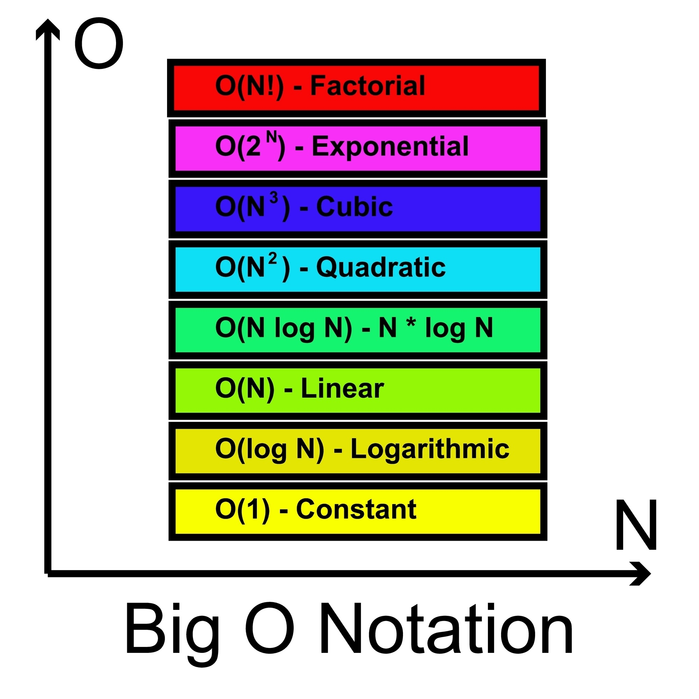

# Exercício: Subconjuntos com Backtracking

Este projeto contém a implementação de um algoritmo de **Backtracking** para resolver um problema clássico de combinatória: encontrar todos os subconjuntos de tamanho $n$ a partir de um conjunto $S$ de elementos únicos.

## 📋 Descrição do Problema
Dado um conjunto $S$ e um valor inteiro $n$, o objetivo é listar todas as combinações possíveis de elementos de $S$ que possuam exatamente $n$ itens.

**Exemplo:**
* **Entrada:** $S = [1, 2, 3]$, $n = 2$
* **Saída:** `[1, 2], [1, 3], [2, 3]`

## 🛠️ Tecnologias Utilizadas
* **Linguagem:** Java
* **Conceito:** Algoritmos de Backtracking (Força Bruta Otimizada)

## 🚀 Como Executar
1. Certifique-se de ter o [Java JDK](https://www.oracle.com/java/technologies/downloads/) instalado.
2. Clone este repositório.
3. Compile o arquivo e execute o programa:
   ```bash
   javac BacktrackingSubconjuntos.java

 ## 🧠 Lógica de Funcionamento
 O algoritmo utiliza recursividade para explorar o espaço de soluções: 
 -Seleção: Para cada elemento, o algoritmo decide entre incluí-lo ou não incluí-lo na solução atual.
- Poda (Backtracking): Caso o tamanho da solução parcial atinja $n$, ou o índice ultrapasse o limite do conjunto, o caminho é encerrado. 
 -Volta (Backtrack): Após explorar o caminho onde um elemento é incluído, o algoritmo o remove da lista para testar o caminho onde ele não faz parte da solução.

 ## 🌳 Representação da Árvore de Decisão
O processo de backtracking pode ser visualizado como uma árvore onde cada nível representa a decisão sobre um elemento do conjunto $S$.

* **Nós:** Representam estados parciais da solução.
* **Ramos da Esquerda:** Representam a decisão de **incluir** o elemento.
* **Ramos da Direita:** Representam a decisão de **não incluir** o elemento.
* **Folhas (Backtrack):** Quando a folha atinge o tamanho $n$ (solução encontrada) ou o fim do array (fim do caminho), o algoritmo retorna para o nó pai para explorar a próxima alternativa.

Esta visualização ajuda a identificar como o algoritmo evita calcular combinações desnecessárias, focando apenas nos caminhos que levam a uma solução válida.

## 📈 Análise de Complexidade
Para entender o desempenho do algoritmo, analisamos o custo de tempo e de espaço conforme o tamanho do conjunto de entrada $N$ e o tamanho do subconjunto desejado $n$.

* **Complexidade de Tempo**: $O(2^N)$No pior cenário, o algoritmo explora todas as possibilidades de subconjuntos. Como para cada um dos $N$ elementos temos duas escolhas (incluir ou não incluir), o número total de estados na árvore de decisão é $2^N$. 
 * Nota: Embora a complexidade teórica seja exponencial, a técnica de backtracking com poda (verificando o tamanho da solução e o número de elementos restantes) reduz drasticamente o número de chamadas recursivas desnecessárias na prática. 

* **Complexidade de Espaço**: $O(N)$A complexidade de espaço é determinada pela profundidade máxima da pilha de recursão. 
 * Pilha de Recursão: Como o algoritmo chama a si mesmo para cada elemento do conjunto original, a profundidade máxima da pilha será proporcional ao número de elementos $N$.* * 
 * Armazenamento: O espaço utilizado para a lista solucaoAtual também é $O(n)$, que é, no máximo, $O(N)$.

 

# Projeto: Knight's Tour (Passeio do Cavalo)

Este projeto apresenta uma solução em **Java** para o problema clássico do "Passeio do Cavalo", onde um cavalo deve visitar todas as 64 casas de um tabuleiro de xadrez $8 \times 8$ exatamente uma vez, utilizando a técnica de **Backtracking**.

## 📋 Sobre o Problema
O objetivo é encontrar uma sequência de movimentos válidos que permita ao cavalo percorrer todo o tabuleiro. Se o cavalo não encontrar um movimento válido que leve à conclusão, o algoritmo "volta atrás" (backtracking) para tentar um caminho alternativo.

## 🛠️ Tecnologias Utilizadas
* **Linguagem:** Java
* **Conceito:** Algoritmos de Backtracking e Estruturas de Dados Matriciais.

## 🚀 Como Executar
1. Certifique-se de ter o [Java JDK](https://www.oracle.com/java/technologies/downloads/) instalado.
2. Clone este repositório.
3. Compile o código e execute o programa:
   ```bash
   javac ResolverCavalo.java

## 🧠 Lógica de Funcionamento
1. O algoritmo utiliza recursividade com as seguintes etapas:
2. Movimentação: Tenta aplicar um dos 8 movimentos possíveis do cavalo.
3. Validação: Verifica se a nova casa está dentro do tabuleiro e ainda não foi visitada.
4. Exploração: Marca a casa como visitada e chama a função recursivamente para o próximo passo.
5. Backtracking: Se o caminho atual não levar a uma solução completa, a casa é desmarcada (resetada para -1), permitindo que o algoritmo explore outras direções.

## 📈 Análise de Complexidade
* **Complexidade de Tempo**: $O(8^{N^2})$
 * O espaço de busca para um tabuleiro $N \times N$ possui $N^2$ casas. Para cada casa, o cavalo tem até 8 movimentos. A força bruta pura resultaria em uma complexidade exponencial. No entanto, o backtracking com poda de estados visitados reduz significativamente esse esforço.


* **Complexidade de Espaço**: $O(N^2)$
 * A profundidade da pilha de recursão é limitada ao número de casas no tabuleiro ($N^2$), e a matriz de marcação do tabuleiro ocupa $O(N^2)$ de espaço.

 
 
## 🧠 Implementação da Heurística de Warnsdorff
Para otimizar o tempo de execução e evitar o comportamento exponencial em tabuleiros maiores, o algoritmo pode ser atualizado para utilizar a Heurística de Warnsdorff.

 * **Conceito**: Em vez de escolher qualquer movimento válido, o algoritmo sempre prioriza a casa vizinha que possui o menor número de movimentos futuros disponíveis.
* **Por que funciona**: Ao "atacar" primeiro as casas mais difíceis (aquelas com menos saídas), reduzimos drasticamente a probabilidade de entrar em caminhos sem saída (dead ends), tornando o processo de busca muito mais direto.
* **Impacto**: Isso transforma a busca exaustiva, que poderia levar horas em tabuleiros grandes, em uma resolução quase instantânea (tempo praticamente linear).

## 💡 Para o Código
O algoritmo implementado realiza uma busca exaustiva (backtracking). Para tabuleiros maiores ou para melhorar a performance, a implementação de heurísticas de ordenação de movimentos (como a de Warnsdorff) é recomendada para evitar o tempo de computação exponencial.

Alterar o código para incluir essa heurística, o ajuste básico no for seria:
1. Criar uma função que conta quantos movimentos possíveis existem a partir de uma casa $(x, y)$.
2. Antes de iterar pelos 8 movimentos no seu loop, criar uma lista com esses movimentos.
3. Ordenar essa lista baseando-se na contagem feita no passo 1 (do menor para o maior).
4. Executar o resolverCavalo seguindo essa ordem ordenada.


 📝 Autor: Gabriel Flores Guimarães